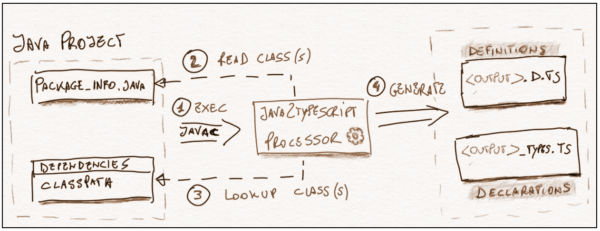

<a href="http://search.maven.org/#search%7Cga%7C1%7Ca%3A%22java2ts-processor%22">


# java2typescript

Java Processor to **generate [Typescript](https://www.typescriptlang.org/)  Definition file (.d.ts)** from whatever Java classes.

## Diagram of solution



## What is it for ?

This is to help developing on **JVM javascript engine** (ie [Nashorn](http://www.oracle.com/technetwork/articles/java/jf14-nashorn-2126515.html)) using [Typescript](https://www.typescriptlang.org/)

The main goal is having the definitions available in the modern IDE like [Visual Studio Code](https://code.visualstudio.com/) and [Atom](https://atom.io/) and then use the **intellisense** feature available for java classes within typescript

## What is it not for ?

It is not a transpiler from Java to Javascript like  [datathings/java2typescript](https://github.com/datathings/java2typescript)

## Similar projects

* [typescript-generator](https://github.com/vojtechhabarta/typescript-generator)
> typescript-generator is a tool for generating TypeScript definition files (.d.ts) from Java JSON classes. If you have REST service written in Java using object to JSON mapping you can use typescript-generator to generate TypeScript interfaces from Java classes.
* [1c](https://1c.wizawu.com/#/whatis)
> 1c is aimed to compile TypeScript to runnable code on both JVM and web browser. You can implement the full stack with TypeScript while using libraries from Maven and NPM together.

## Related Project

* [jvm-npm](https://github.com/bsorrentino/jvm-npm)
> NPM compliant CommonJS module loader for the JVM

## DEMO

To give an idea about **how to work** there is a demo available online [here](https://java2ts-demo.herokuapp.com/).

> The backend of such demo has been developed using typescript on jvm provided by this project itself ([dogfooding](https://en.wikipedia.org/wiki/Eating_your_own_dog_food)).
> [java2typescript-demo project](https://github.com/bsorrentino/java2typescript-demo)

## Description

Basic idea is to develop a Project by mixing Java & Javascript code or even all in Javascript relying on the  [Nashorn Javascript engine](http://www.oracle.com/technetwork/articles/java/jf14-nashorn-2126515.html) embedded in JDK from Java8. This powerful engine enable Javascript language in JVM and allows to access to every java class either from JDK and external JAR(s) in a pretty straightforward way.
That's cool, the Javascript is very easy to learn, but the question are :
 1. _Is it possible develop a complete and well structured Javascript application ?_
 1. _Developing in Javascript on JVM is as productive as programming in Java ?_

Just to answer the questions above that this project has been developed.

> 1. _Is it possible develop a complete and well structured Javascript application ?_
>> **Yes it is, but with help of a powerful [Typescript](https://www.typescriptlang.org/) that fills language's gaps and produce Javascript as output**  
>
> 1. _Developing in Javascript on JVM is as productive as programming in Java ?_
>> **Yes it could be, but we need :**
>> * An IDE with intellisense capability that is able to inspect java/javascript classes during development.
>>> **This is the main goal of project, that is to generate Typescript Declarations enabling every Typescript-Aware IDE (eg. [Atom](https://ide.atom.io/), [VSCode](https://code.visualstudio.com/)) to give you the __intellisense__ feature make more comfortable use access to Java features/classes from Javascript**
>>
>> * A module module system that allow to arrange application in separate well-defined modules
>>> **This is achieved by project [jvm-npm](https://github.com/bsorrentino/jvm-npm) that enable use of [commonJS](https://en.wikipedia.org/wiki/CommonJS) enabling [Typescript Modules](https://www.typescriptlang.org/docs/handbook/modules.html).**
>

## Getting Started

Let assume that you have successfully setup a java project

### Declares the classes you want to generate the Typescript declaration for

Create a file `package-info.java` and annotate the given package with `@Java2TS` that will contain all the `@Type` of which you want the Typescript declaration.

** Type Attributes **

Name | Mandatory | Type | Description
--- | --- | --- | ---
**value** | Yes | Class | Full Qualified Name of Java class
**alias** | No | String | Assign a new name to exported class in typescript
**export** | No | boolean | if **true**, other than typescript declaration adds definition in file *`-types.ts`. **It is need for instantiable classes, in order  to use `new` operator or factory method(s)**

**Example**
```Java
@Java2TS(declare = {

  @Type(java.nio.file.Files.class, export="true"),
  @Type(java.nio.file.Path.class),
  @Type(java.nio.file.Paths.class, export="true"),

  @Type(value=java.util.stream.Stream.class,export=true),

  @Type(java.util.Collection.class),
  @Type(java.util.Map.class),
  @Type(value=java.util.List.class, alias="List" ),
  @Type(java.util.Set.class),
  @Type(value=java.util.Arrays.class, export=true),

  @Type(java.util.Optional.class),

  @Type(value=java.net.URI.class, export=true),
  @Type(java.net.URL.class),

})
package org.mypackage;
```

### Add the dependency containing the Java2TS Processor

```xml
<dependency>
  <groupId>org.bsc.processor</groupId>
  <artifactId>java2ts-processor</artifactId>
  <version>version</version>
</dependency>

```
### Add the Annotation Processor Plugin

```xml
<plugin>
  <groupId>org.bsc.maven</groupId>
  <artifactId>maven-processor-plugin</artifactId>
  <version>3.3.3</version>
  <executions>
    <execution>
      <id>process</id>
      <goals>
        <goal>process</goal>
      </goals>
      <phase>generate-sources</phase>
      <configuration>
          <outputDirectory>${project.build.directory}</outputDirectory>
       <options>
            <ts.outfile>name</ts.outfile><!-- name of generated file -->
       </options>
      </configuration>
    </execution>
  </executions>
</plugin>

```

### Use Maven Archetype

The easier way to start your **Typescript on JVM** project is using the provided maven archetype

**Interactive Mode**

>```
>mvn archetype:generate \
>-DarchetypeGroupId=org.bsc.processor \
>-DarchetypeArtifactId=java2ts-processor-archetype \
>-DarchetypeVersion=1.0-rc1
>```
